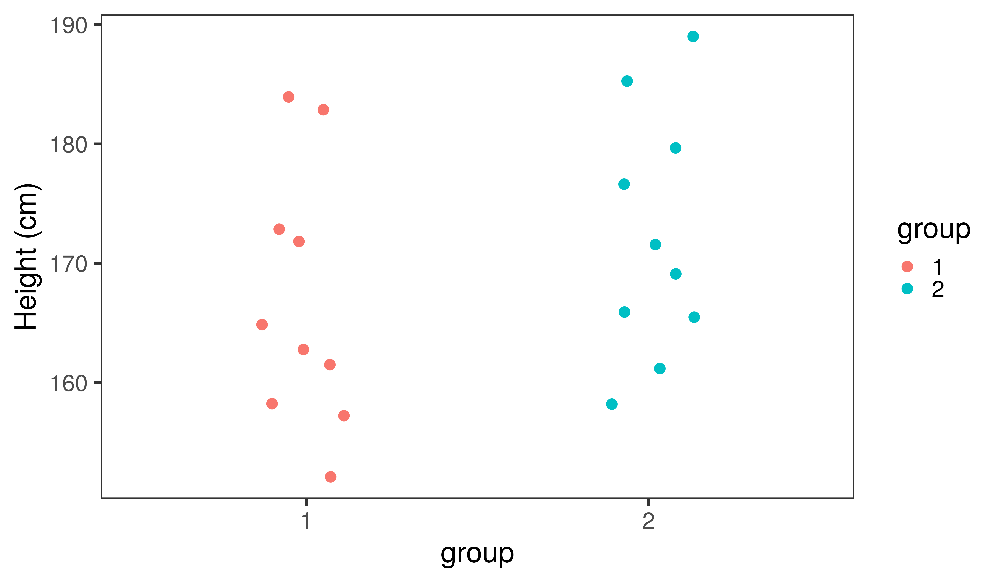

<!-- adding bold and italic options -->
<style>
em {
  font-style: italic
}
strong {
  font-weight: bold;
}
</style>

## Data analysis 3

- Two variable experimental design
- Visualising two variables
- Hypothesis testing
- *p*-values and tests of significance

--- .segue .dark 

## Two variable experimental design

--- .class #id

## Examples

Quantitative variable|Categorical variable
---------------------|--------------------
Number of species|Habitat
Blood pressure|Drug test and control groups
Number of genes|Free living or parasitic microorganism
Disease prevalence|Country
Gene expression|Developmental stage

--- &twocol bg:white

## Penguins

- Body mass: quantitative continuous
- Species: categorical

*** =left


**Chinstrap penguin**

*** =right


**Gentoo penguin**

--- .class bg:white

## Data visualisation


--- &twocol bg:white

## Box plot

*** =left

- Also know as a box and whisker plot
- The box shows:
  + **Median** (50th percentile)
  + **lower quartile** (25th percentile)
  + **upper quartile** (75th percentile)
- Note upper - lower quartile is the **interquartile range**
- **Whiskers** extend to the furthest data point within 1.5 x the interquartile range
- Anything outside this range is an **outlier**

  
*** =right


--- &twocol bg:white

## Barchart

*** =left

- Species goes on the x axis
- **Mean** body mass on the y axis
- **Error bars** often used to display the sample variation
- +/- one **standard deviation** in this example

*** =right


--- &twocol bg:white

## Two very different "barcharts"

*** =left


*** =right


--- .class #id

## Showing the data points

<embed src="./assets/img/s41551-017-0079.pdf" title="plot of chunk unnamed-chunk-8" alt="plot of chunk unnamed-chunk-8" width="100%" height="500" type="application/pdf" />

--- .class bg:white

## Showing the data points


--- .segue .dark 

## Hypothesis testing

--- .class bg:white

## In science we call our questions hypotheses

- A `hypothesis` (plural `hypotheses`) is a proposed explanation of something
- It must be **testable**
- That means, we can predict different observations if the hypothesis is true or false


--- .class #id

## We generally split the question into two:
- `Null hypothesis`: there is no effect
- `Alternate hypothesis`: there is an effect
- We try to reject or disprove the null hypothesis
- Then we can accept the alternate hypothesis


--- .class #id

## Example: human sex ratio

### You hypothesise that the human sex ratio at birth may be slightly different to the 50:50 ratio generally assumed

**Predictions**

- Null hypothesis: 50% males, 50% females
- Alternate hypothesis: % male and % female are different

**Results and conclusions**

>- The observed percentage turns out to be around 52.5%
>- You reject the null hypothesis and accept the alternate hypothesis
>- If 50% were observed, then you would fail to reject the null hypothesis

--- .class bg:white

## Fail to reject the null hypothesis?

- We used a very specific wording when our observation is consistent with the null hypothesis
- Actually a double negative
- You do not prove the null hypothesis


--- .segue .dark 

## *p*-values and tests of significance

--- .class #id

## Interpreting data can be subjective


- Subtle patterns are easier to see with big sample sizes
- Small sample sizes can give false impressions

--- .class #id

## A simple example:

- There are two student groups, you hypothesise that one is taller than the other
- Height is a normally distributed continuous quantitative variable
- **Null hypothesis**: there is no difference in (the distribution of) height between the two groups
- **Alternate hypothesis**: there is a difference
- You measure 10 students from each group and compare...

--- .class bg:white

## Comparison 1



--- .class bg:white

## Comparison 2


--- .class bg:white

## Comparison 3


--- .class bg:white

## Comparison 4


--- .segue .dark

## So are the groups different?

--- .class #id

## All the groups are sampled from the same normal distribution


```r
group1 <- rnorm(10, 170, 10)
group2 <- rnorm(10, 170, 10)

group1
```

```
##  [1] 163.8797 178.4845 157.7566 171.3462 179.2484 171.1590 163.1358 181.1424
##  [9] 177.0127 172.1342
```

```r
group2
```

```
##  [1] 173.8838 179.8192 185.9014 180.5571 176.4741 162.1718 156.6791 162.6154
##  [9] 175.7260 164.2008
```

--- .segue .dark

## Now let's increase the sample size

--- .class bg:white

## Comparison 1


--- .class bg:white

## Comparison 2


--- .class bg:white

## Comparison 3


--- .class bg:white

## Comparison 4


--- .class #id

## The problem

- Rejecting the null hypothesis can be subjective
- We need a way of doing this mathematically
- Essentially, we want to know: 

**The probability of observing the data if the null hypothesis is true**

### This is called a `p-value`

--- .class #id

## *p*-value

- A *p*-value is a probability
- The probability of observing the data if the null hypothesis is true
- Scales between 0 and 1
- Low values indicate a low probability
- We need some threshold value where we can reject the null hypothesis
- Typically 0.05 or 0.01
- Anything below this is termed `significant`, anything above is `non-significant`

--- .class #id

## Students *t*-test

- A statistical test for quantitative, normally distributed variables
- Compare groups or sample pairs
- Developed in 1908 by William Gosset


--- .class #id

## Using the *t*-test

- Null hypothesis: the means of the two groups are equal
- Alternate hypothesis: the means are different
- *p*-value: probability of observing the data if the means are equal

### Assumptions

- the investigated variable is normally distributed
- the groups have equal variance
  + but there are ways to get around this
- the samples are independent

--- .class bg:white

## Back to our example


- *t*-statistic = **-1.272**, degrees of freedom = **198**, *p*-value = **0.205**

--- .class bg:white

## Penguins


 *t*-statistic = **-19.335**, degrees of freedom = **185**, *p*-value **< 0.01**

--- .class #id

## Data analysis 3

- Two variable experimental design
- Visualising two variables
- Hypothesis testing
- *p*-values and tests of significance


--- &thankyou

## Next time

**Analysis of two quantitative variables**

